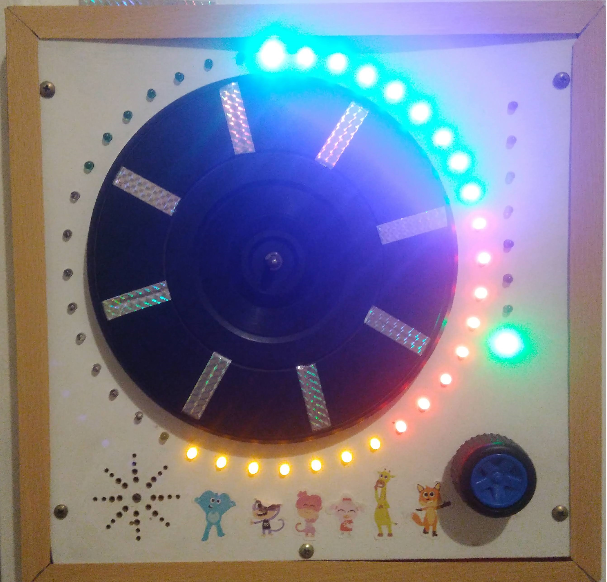
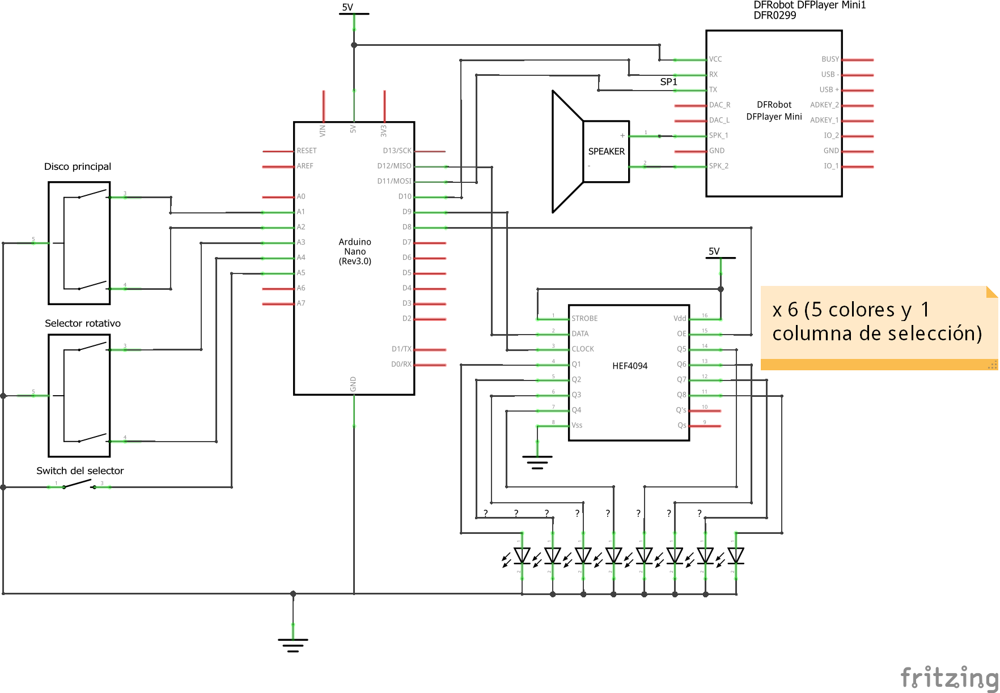

# Ruleta con Luces y Sonido

Juego electrónico para niños pequeños que aprecian el movimiento con ruedas, luces de distintos colores y sonidos graciosos.

Las principales partes del dispositivo están armadas con materiales totalmente reciclados, siendo la rueda principal ni más ni menos que el plato giradiscos de un viejo reproductor de vinilos de dudosa calidad ;).

El juego consta de 8 efectos seleccionables por medio del encoder rotativo con pulsador que se encuentra en el extremo inferior derecho y basicamente consiste en reproducir distintas "escenas" de luces y sonidos generados desde un modulo reproductor MP3 incorporado, con sonidos pre-grabados en una tarjeta micro-sd, siempre acompañando el giro del disco principala modo de ruleta.

La lógica está programada en C++ sobre una placa [Arduino](https://www.arduino.cc/) Nano utilizando [PlatormIO](https://platformio.org/) como entorno de desarrollo integrado con [Visual Studio Code](https://code.visualstudio.com/). Todo el código fuente se encuentra en este repositorio.

&nbsp;

---

## Diagrama esquemático electrónico

&nbsp;

---

## Video demostrativo

&nbsp;

---

## Software de terceros

* [Arduino](https://www.arduino.cc/)
* [DFRobotDFPlayerMini](https://github.com/DFRobot/DFRobotDFPlayerMini)
* [PlatormIO](https://platformio.org/)
* [Visual Studio Code](https://code.visualstudio.com/)
* [Fritzing](https://fritzing.org/)
